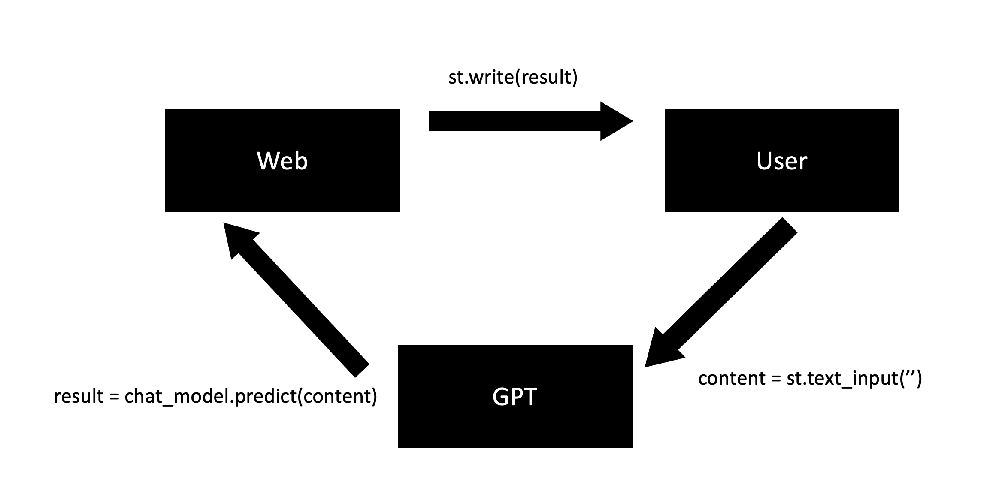

# ChatGPT Anecdote Maker

This is a simple code that, when provided with a topic, allows you to receive a relevant anecdote from ChatGPT.
## Flow of my code 🦭




## What is Langchain 🦜️🔗 ? 

LangChain is a framework for developing applications powered by language models [[1]]


If you want to learn more about Langchain, [Click Here](https://python.langchain.com/docs/get_started/introduction)


## Getting Started

Download Source code 
```
  git clone https://github.com/Skkuhodomo/Chat-GPT-Anecdote-Maker.git
```
</pre>

Install library
```
  pip install -r requirement.txt
```

## Example: 


##### References:
  [1]: https://python.langchain.com/docs/get_started/introduction

